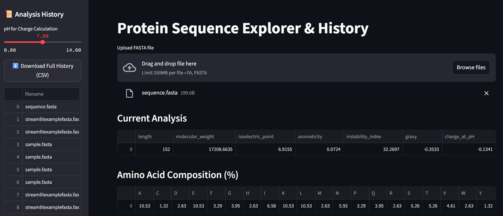

# Protein Sequence Explorer & Analysis Tool

This is a bioinformatics mini-project designed to analyze protein FASTA sequences using:

- Python and Streamlit for a simple web-based interface 
- Biopython for sequence and protein calculations 
- Plotly for interactive visualization 
- SQLite to store upload history 
- NCBI BLASTp integration for homolog search 
- PDF report export for documentation

> ⏱️ Built in 3 days using Linux, WSL, Git, and GitHub for demonstration and portfolio purposes.

---

## 🔍 Features

- Upload protein FASTA sequences and perform automatic analysis 
- Calculate:
  - Sequence length 
  - Molecular weight 
  - Isoelectric point 
  - Aromaticity 
  - Instability index 
  - GRAVY score 
  - Charge at custom pH 
- Amino Acid Composition table (%) 
- Interactive bar chart using Plotly 
- Run BLASTp (via NCBI) to retrieve homologous sequences 
- Save analysis history to SQLite database 
- Export analysis as:
  - PDF Report 
  - CSV History 

---

## 🧪 Tech Stack

| Tool         | Purpose                               |
|--------------|----------------------------------------|
| Python       | Scripting and application logic        |
| Streamlit    | Interactive web interface              |
| Biopython    | Protein analysis and FASTA parsing     |
| Pandas       | DataFrame handling and preprocessing   |
| SQLite       | Store upload history                   |
| Plotly       | Data visualization                     |
| ReportLab    | PDF generation                         |
| NCBI BLAST   | Homolog search via API                 |

---

## 🚀 Getting Started

Follow these steps to run the project locally on your machine:

```bash
# 1. Clone the repository
git clone https://github.com/Snehasuresh22/protein-sequence-explorer.git
cd protein-sequence-explorer

# 2. Create and activate a virtual environment
python3 -m venv venv
source venv/bin/activate

# 3. Install required packages
pip install -r requirements.txt

# If requirements.txt is missing, generate it using:
# pip freeze > requirements.txt

# 4. Run the Streamlit app
streamlit run app.py

---

## Sample Screenshots

### App Interface


### Amino Acid Composition


### Protein Trends from Upload History


### NCBI BLAST Results


### PDF Report Sample


